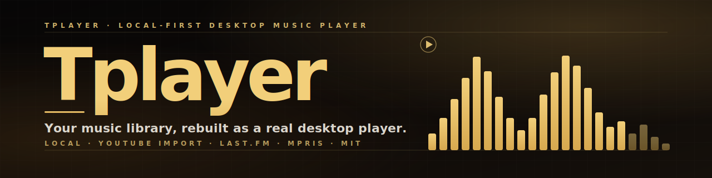
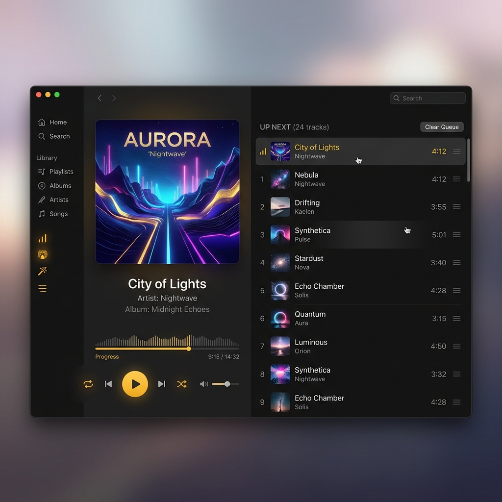
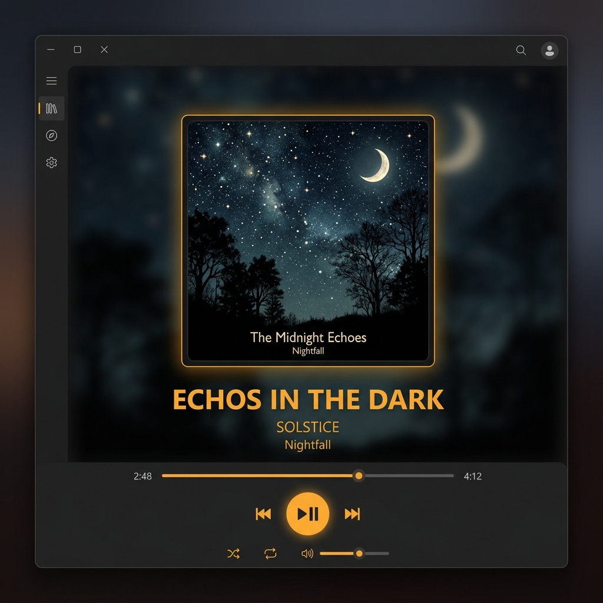
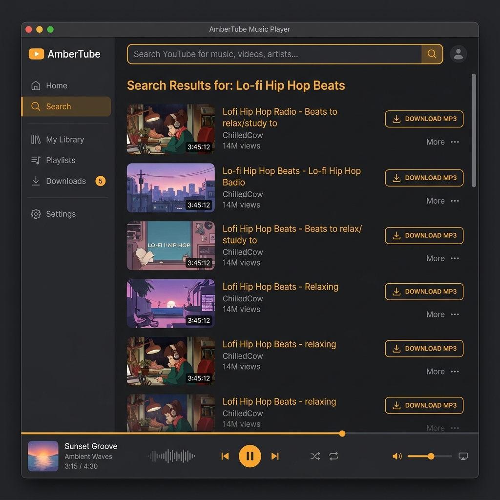

<div align="center">

<a href="https://twarga.github.io/Tplayer/">
  
</a>

<p>
  <a href="https://github.com/Twarga/Tplayer/releases/latest">
    
  </a>
  <a href="LICENSE">
    
  </a>
  <a href="https://github.com/Twarga/Tplayer/actions/workflows/release.yml">
    
  </a>
  <a href="https://github.com/Twarga/Tplayer/actions/workflows/pages.yml">
    
  </a>
  <a href="https://twarga.github.io/Tplayer/">
    
  </a>
  <a href="https://www.electronjs.org/">
    
  </a>
  <a href="https://react.dev">
    
  </a>
  <a href="https://github.com/yt-dlp/yt-dlp">
    
  </a>
</p>

<p>
  <a href="https://twarga.github.io/Tplayer/"><b>Landing</b></a> ·
  <a href="https://github.com/Twarga/Tplayer/releases"><b>Releases</b></a> ·
  <a href="CHANGELOG.md"><b>Changelog</b></a> ·
  <a href="https://github.com/Twarga/Tplayer/issues"><b>Issues</b></a> ·
  <a href="CONTRIBUTING.md"><b>Contributing</b></a>
</p>

</div>

---

## Table of contents

- [What&rsquo;s new in v0.3.0](#-whats-new-in-v030)
- [Features](#-features)
- [Screenshots](#-screenshots)
- [Quick start](#-quick-start)
- [Keyboard shortcuts](#-keyboard-shortcuts)
- [Architecture](#-architecture)
- [Development](#-development)
- [Packaging](#-packaging)
- [Troubleshooting](#-troubleshooting)
- [Roadmap](#-roadmap)
- [FAQ](#-faq)
- [Project docs](#-project-docs)
- [Contributing](#-contributing)
- [Security](#-security)
- [License](#-license)
- [Acknowledgments](#-acknowledgments)

---

## ✨ What&rsquo;s new in v0.3.0

- 🎞 **YouTube playlist import** — fetch a full playlist, select individual videos, set format/quality/metadata, and download as a batch. Auto-creates an app playlist on completion, matched by download history (no more fuzzy title guessing).
- 🔎 **Global search overlay** — <kbd>Ctrl</kbd>+<kbd>K</kbd> command-palette style overlay for tracks, albums, artists, and playlists. Keyboard navigable (↑/↓/Enter/Esc).
- 🖱 **Track right-click context menu** — Play Now, Add to Queue (Next/Last), Add to Playlist submenu, Toggle Favorite. Available in Library, Playlist Detail, and Home.
- ☑ **Playlist mass selection** — checkbox per row, Select All, batch delete in a single SQLite transaction.
- ⚡ **Virtualized grids** — Albums, Artists, and Playlists use `@tanstack/react-virtual`. Libraries with 200+ albums no longer freeze.
- 🚀 **Single-transaction queue** — playing an album/artist/playlist fires one `queue:set` IPC call instead of N sequential adds.
- 🌓 **Home polish** — time-aware greeting, favorites section, real mosaic covers for album/artist/playlist cards.

See the full [CHANGELOG](CHANGELOG.md).

---

## ✨ Features

| | Feature | Description |
|---|---|---|
| 🎵 | **Local-first library** | Scan any folder. Albums, artists, folders, and playlists — indexed locally with `better-sqlite3` |
| ⬇ | **YouTube import** | Search or paste a URL, pick a video or full playlist, choose format/quality, and import via `yt-dlp` + FFmpeg |
| 🎚 | **10-band equalizer** | Bundled presets (Flat, Bass, Treble, Vocal, Rock, …), persisted across sessions |
| 📝 | **Queue &amp; playlists** | Batch queue, shuffle, repeat, right-click context, mass selection, mosaic playlist covers |
| 🔁 | **Last.fm scrobbling** | Authenticated session, now-playing updates, offline-tolerant scrobble queue |
| ⌨ | **Linux media keys** | MPRIS via `dbus-next` — play/pause/next/prev/seek from keyboard, tray, or lock screen |
| 🔎 | **Global search** | `Ctrl+K` command-palette overlay for tracks, albums, artists, and playlists |
| 🎨 | **Editorial dark UI** | Warm ink-and-gold palette, big album art, thin dividers, direct controls |
| ⚡ | **Fast &amp; virtualized** | Virtualized grids keep 200+ album libraries snappy |
| 🔒 | **100% local, private** | No accounts, no telemetry, no cloud sync. Your files stay on your machine |

---

## 🖥 Screenshots

<div align="center">



<br /><br />

<table>
  <tr>
    <td></td>
    <td></td>
  </tr>
  <tr>
    <td align="center"><sub><b>Detailed now-playing</b> — playback stays visible while browsing.</sub></td>
    <td align="center"><sub><b>YouTube import</b> — search, pick, and download into your library.</sub></td>
  </tr>
</table>

</div>

---

## 🚀 Quick start

### Requirements

- **Linux** (primary target) or **Windows**
- **`ffmpeg`** on your system path
- **`yt-dlp`** on your system path *(optional — only for YouTube import)*

### Linux (one-liner)

```bash
curl -fsSL https://twarga.github.io/Tplayer/install.sh | bash
```

This downloads the latest AppImage from GitHub Releases and installs it into `~/.local/bin`.

### Manual downloads

- **Linux AppImage** &mdash; [Latest release](https://github.com/Twarga/Tplayer/releases/latest)
- **Windows installer (NSIS)** &mdash; [Latest release](https://github.com/Twarga/Tplayer/releases/latest)
- **Source** &mdash; [Twarga/Tplayer](https://github.com/Twarga/Tplayer)

### First run

1. Pick a folder to scan &mdash; Tplayer indexes your library locally
2. (Optional) Paste a YouTube URL in the YouTube tab to import audio
3. (Optional) Connect Last.fm in **Settings** to scrobble
4. Press <kbd>Ctrl</kbd>+<kbd>K</kbd> from anywhere to jump around

---

## ⌨ Keyboard shortcuts

| Keys | Action |
|---|---|
| <kbd>Space</kbd> | Play / pause |
| <kbd>Ctrl</kbd> + <kbd>K</kbd> | Global search |
| <kbd>←</kbd> / <kbd>→</kbd> | Seek &minus;5s / &plus;5s |
| <kbd>↑</kbd> / <kbd>↓</kbd> | Volume up / down |
| <kbd>N</kbd> / <kbd>P</kbd> | Next / previous track |
| <kbd>S</kbd> / <kbd>R</kbd> / <kbd>F</kbd> | Shuffle / repeat / favorite |
| <kbd>Esc</kbd> | Close dialog or overlay |

Linux media keys (play/pause/next/prev) also work globally via MPRIS.

---

## 🏗 Architecture

```
Tplayer/
├── src/
│   ├── main/       ← Electron main: SQLite, yt-dlp pipeline, MPRIS, Last.fm scrobbler
│   ├── preload/    ← Context-isolated bridge, typed IPC to the renderer
│   ├── renderer/   ← React UI — Home, Library, Albums, Artists, Playlists, YouTube, Settings
│   └── shared/     ← Domain types + IPC channel contracts (used by both sides)
├── site/           ← GitHub Pages landing page (index.html + styles.css)
├── assets/         ← Banner, screenshots, logo, install.sh
├── docs/           ← Brand, release checklist, production readiness, repo hygiene
├── build/          ← Packaging icons (icon.png, icon.ico)
└── .github/        ← Release + Pages workflows, issue/PR templates
```

Three-process Electron model with typed IPC boundaries:

```text
┌───────────────────────────────┐      ┌──────────────────────────────────┐
│ Renderer  (src/renderer)      │      │ Main process  (src/main)         │
│ React 19 · Zustand · Tailwind │◀──▶ │ Electron · yt-dlp · FFmpeg       │
│ Virtualized grids · Radix UI  │ IPC  │ better-sqlite3 · MPRIS · Last.fm │
└───────────────────────────────┘      └──────────────────────────────────┘
              ▲                                      ▲
              │  shared types (src/shared)           │
              └──────────────────────────────────────┘
                 typed contracts through preload
                       (src/preload)
```

**Stack:** Electron 33 · React 19 · Vite 5 · TypeScript 5 · Tailwind CSS 3 · Zustand · Radix UI · @tanstack/react-virtual · better-sqlite3 · music-metadata · yt-dlp · fluent-ffmpeg · dbus-next

---

## 🧑‍💻 Development

### Prerequisites

- **Node.js 18+** and npm
- **`ffmpeg`** on your system path
- **`yt-dlp`** on your system path *(only if you want to test YouTube import)*

### Setup

```bash
git clone https://github.com/Twarga/Tplayer.git
cd Tplayer
npm install
```

### Common scripts

```bash
npm run dev         # hot-reload dev app
npm run typecheck   # tsc --noEmit
npm run build       # compile main + preload + renderer
npm run lint        # eslint
```

---

## 📦 Packaging

```bash
npm run package:linux   # Linux AppImage
npm run package:win     # Windows NSIS installer
npm run package:dir     # Unpacked directory (fast smoke test)
```

Artifacts land in `release/`. Tagged pushes (`vX.Y.Z`) trigger the GitHub Actions release workflow, which builds the Linux AppImage and Windows installer and publishes them to GitHub Releases.

---

## 🔧 Troubleshooting

**AppImage won&rsquo;t run**

```bash
chmod +x Tplayer-0.x.y.AppImage
./Tplayer-0.x.y.AppImage
# if your kernel rejects the default sandbox:
./Tplayer-0.x.y.AppImage --no-sandbox
```

**YouTube import fails**

```bash
yt-dlp --version           # confirm yt-dlp is installed and on PATH
pip install -U yt-dlp      # or your package manager's upgrade path
```

**Media keys don&rsquo;t work (Linux)**

→ Confirm MPRIS is enabled on your desktop. Quick check:

```bash
playerctl --list-all       # should list 'tplayer' while the app is running
```

**Library scan is slow the first time**

→ Expected &mdash; first-run parses ID3/tag metadata for every file. Subsequent scans are incremental and fast.

**Last.fm scrobbles don&rsquo;t show up**

→ Open **Settings → Last.fm** and confirm it shows **Connected**. Offline scrobbles are queued locally and flushed when the network returns.

**Playback is silent on Linux**

→ Tplayer uses the Chromium audio backend, so it follows the same output routing as Firefox or Chromium. Check PipeWire/PulseAudio output device.

**`ffmpeg` not found**

```bash
# Debian / Ubuntu
sudo apt install ffmpeg

# Fedora
sudo dnf install ffmpeg

# Arch
sudo pacman -S ffmpeg
```

---

## 🗺 Roadmap

- [x] Local playback, library scan, queue, EQ, favorites
- [x] YouTube video **and** playlist import, download history
- [x] Last.fm now-playing and scrobble
- [x] MPRIS Linux integration
- [x] Packaging &mdash; Linux AppImage + Windows NSIS
- [x] GitHub Pages landing page + release workflow
- [x] Virtualized grids &amp; single-transaction queue
- [ ] macOS packaging
- [ ] Lyrics provider integration
- [ ] Smart playlists / auto-mixes
- [ ] Mobile remote control (MPRIS already exposed)

See [`docs/planning/remake.md`](docs/planning/remake.md) for the complete roadmap and design notes.

---

## ❓ FAQ

<details>
<summary><b>Is Tplayer free?</b></summary>

Yes. Tplayer is free and open source under the MIT license. No accounts, no paid tiers, no telemetry.
</details>

<details>
<summary><b>Does it work offline?</b></summary>

Yes. Local playback, library browsing, queue, and EQ all work fully offline. Only YouTube import and Last.fm scrobbling need the network.
</details>

<details>
<summary><b>What audio formats are supported?</b></summary>

MP3, FLAC, M4A/AAC, OGG, and WAV. YouTube imports default to high-quality M4A via <code>yt-dlp</code> + FFmpeg.
</details>

<details>
<summary><b>Which operating systems are supported?</b></summary>

Linux is the primary target (AppImage). Windows installer ships as well. macOS packaging is planned.
</details>

<details>
<summary><b>Does Tplayer upload or collect my music?</b></summary>

No. Tplayer is fully local-first. Your files and listening history never leave your machine unless you enable Last.fm scrobbling.
</details>

<details>
<summary><b>Where do imported YouTube tracks live?</b></summary>

In the same library you already browse, tagged with <code>source = 'youtube'</code> in the database so the Home view can surface recent imports separately.
</details>

<details>
<summary><b>Why Electron and not a native toolkit?</b></summary>

Electron + React lets the UI move fast and stay editorial on Linux and Windows from a single codebase. Performance-critical work (scanning, queue, EQ, yt-dlp orchestration) happens in the Node main process, not the renderer.
</details>

---

## 📚 Project docs

| Document | Purpose |
|---|---|
| [`docs/brand.md`](docs/brand.md) | Public identity: voice, colors, screenshot direction |
| [`docs/planning/remake.md`](docs/planning/remake.md) | Completed MVP work and post-MVP release plan |
| [`docs/release-checklist.md`](docs/release-checklist.md) | Release requirements and manual testing steps |
| [`docs/production-readiness.md`](docs/production-readiness.md) | B1&ndash;B10 production-preparation summary |
| [`docs/repository-hygiene.md`](docs/repository-hygiene.md) | Ignore list and clean-repo rules |
| [`CONTRIBUTING.md`](CONTRIBUTING.md) | Local setup, commit scope, and contribution rules |

---

## 🙌 Contributing

Contributions are welcome &mdash; especially around packaging, platform support, and UI polish. By participating in this project, you agree to abide by the [Code of Conduct](CODE_OF_CONDUCT.md).

See [`CONTRIBUTING.md`](CONTRIBUTING.md) for setup, commit scope, and repo-hygiene rules. Before opening a pull request:

```bash
npm run typecheck
npm run build
```

Keep commits small and task-focused. UI changes should stay inside the warm-dark editorial direction described in [`docs/brand.md`](docs/brand.md).

---

## 🔒 Security

If you discover a security issue, **please do not open a public issue**. See [`SECURITY.md`](SECURITY.md) for the private disclosure flow.

---

## 📄 License

[MIT](LICENSE) &copy; [Twarga](https://github.com/Twarga)

---

## 🙏 Acknowledgments

Tplayer stands on the shoulders of an incredible open-source ecosystem. Special thanks to:

- **[yt-dlp](https://github.com/yt-dlp/yt-dlp)** &mdash; for making YouTube import reliable and respectful
- **[FFmpeg](https://ffmpeg.org/)** &mdash; for doing the media heavy lifting
- **[better-sqlite3](https://github.com/WiseLibs/better-sqlite3)** &mdash; fast, synchronous SQLite for Node
- **[music-metadata](https://github.com/borewit/music-metadata)** &mdash; for clean tag parsing
- **[electron-vite](https://electron-vite.org/)** &mdash; for the nicest Electron DX today
- **[Radix UI](https://www.radix-ui.com/)** &mdash; for accessible headless primitives
- **[Lucide](https://lucide.dev/)** &mdash; for the icon set
- The **Last.fm**, **MPRIS**, and **D-Bus** communities for keeping desktop Linux media alive

---

<div align="center">
  Made with 🎵 and ☕ by <a href="https://github.com/Twarga"><b>Twarga</b></a>
  <br />
  <sub>Without music, life would be a mistake.</sub>
</div>
