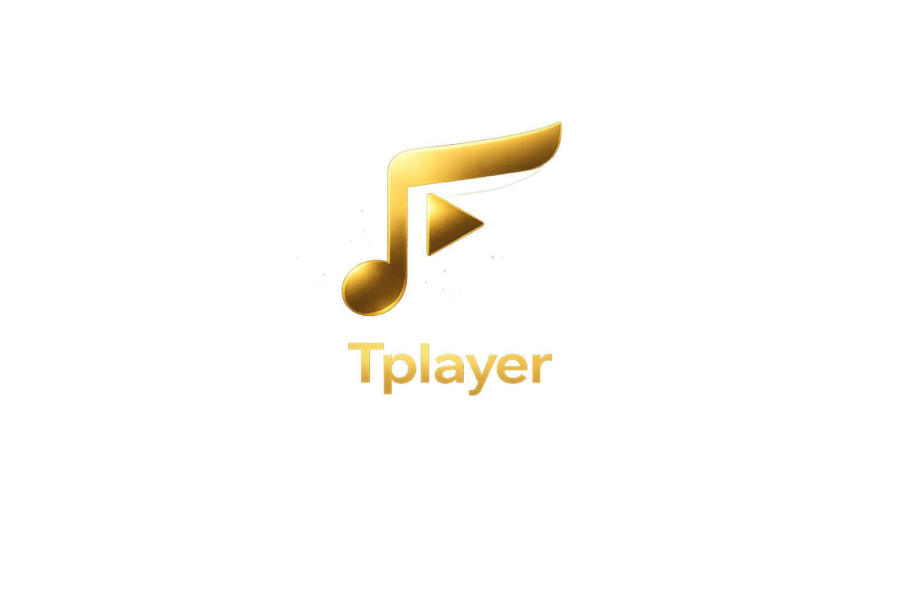

# Tplayer

<p align="center">
  
</p>

<p align="center">
  A polished local-first desktop music player with YouTube import. Fast playback, clean queue control, imported tracks beside your albums, Last.fm scrobbling, Linux media-key support, and a warm dark interface.
</p>

<p align="center">
  <strong><a href="https://twarga.github.io/Tplayer/">Website</a></strong> •
  <strong><a href="https://github.com/Twarga/Tplayer/releases">Downloads</a></strong>
</p>

<p align="center">
  
  
  
  
  
  
  
  
  
</p>

## What it is

Tplayer turns a local music folder into a refined daily player. It focuses on the music instead of filler dashboards, offering a seamless experience for playback, discovery of local files, and integration with YouTube for expanding your personal library.

## Core workflow

1. Scan your local music library
2. Import new tracks directly from YouTube
3. Build and manage your playback queue
4. Scrobble listening history to Last.fm
5. Control playback using global keyboard shortcuts and MPRIS

## Features

- Local-first library scanning for music folders
- Playback with queue, seek, shuffle, repeat, and volume control
- YouTube search and audio import for building a personal library
- Persistent download history
- Playlists, albums, artists, folders, and library browsing
- Last.fm now-playing and scrobbling support
- MPRIS integration for Linux media controls
- Equalizer support with presets and persistence
- Dark editorial interface with warm amber/gold accents

## Tech stack

- Electron 33 (with electron-vite)
- React 19
- Vite
- Tailwind CSS
- TypeScript
- Zustand
- better-sqlite3
- yt-dlp
- FFmpeg
- dbus-next (MPRIS)

## Status

Tplayer is in production-prep hardening. Core features including local playback, YouTube import, Last.fm scrobbling, EQ, and MPRIS integration are complete, and the repo now includes packaging plus GitHub release and Pages deployment workflows.

## Product docs

- [`docs/brand.md`](docs/brand.md) - public identity, voice, colors, screenshot direction
- [`docs/planning/remake.md`](docs/planning/remake.md) - completed MVP work and post-MVP release plan
- [`CONTRIBUTING.md`](CONTRIBUTING.md) - local setup, commit scope, and contribution rules
- [`docs/release-checklist.md`](docs/release-checklist.md) - release requirements and manual testing steps
- [`docs/production-readiness.md`](docs/production-readiness.md) - B1-B10 production preparation summary

## Development

Prerequisites:

- Node.js 18 or newer
- npm
- FFmpeg available on your system path
- `yt-dlp` available on your system path for YouTube import

Install dependencies:

```bash
npm install
```

Run the app in development:

```bash
npm run dev
```

Typecheck:

```bash
npm run typecheck
```

Compile the Electron/Vite app:

```bash
npm run build
```

## Packaging

To package the application for distribution, you can use the built-in packaging scripts:

```bash
# Build Linux AppImage
npm run package:linux

# Build Windows installer
npm run package:win
```

Release artifacts will be generated in the `release/` directory.

## License

MIT
